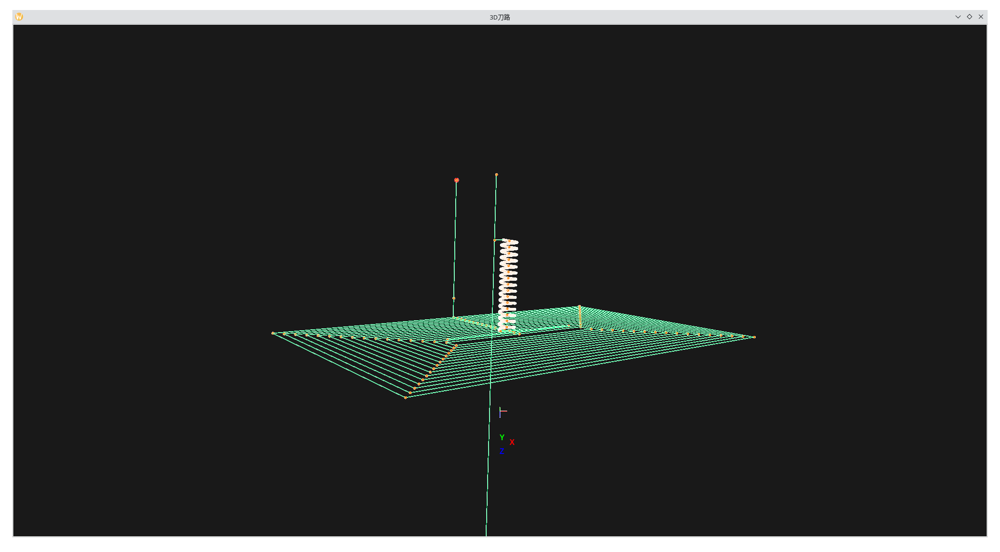
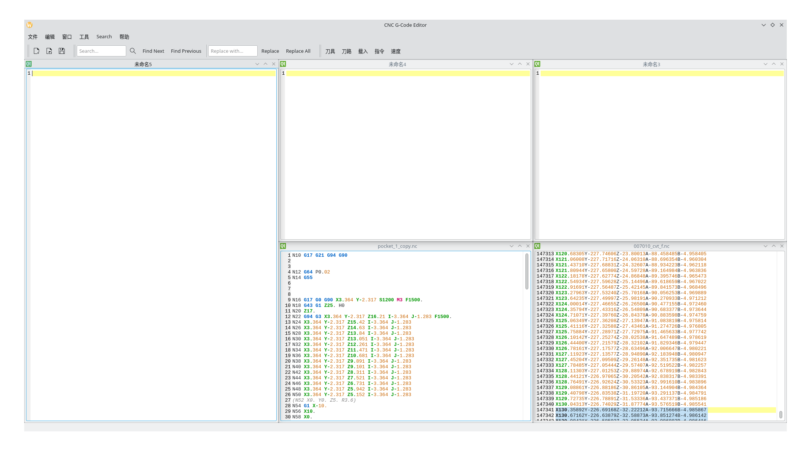
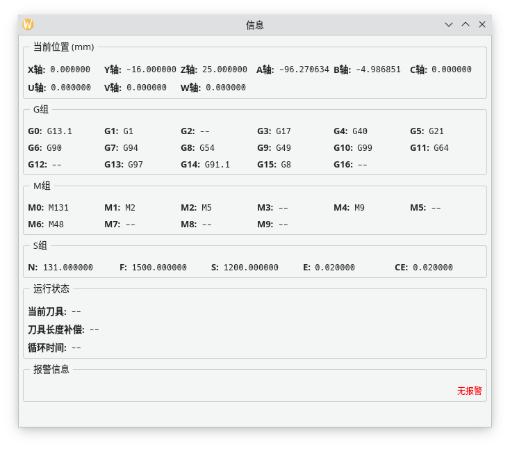
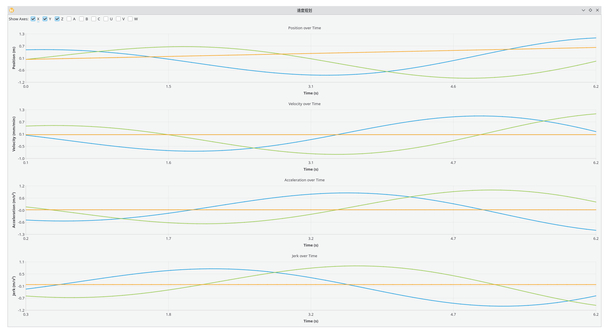
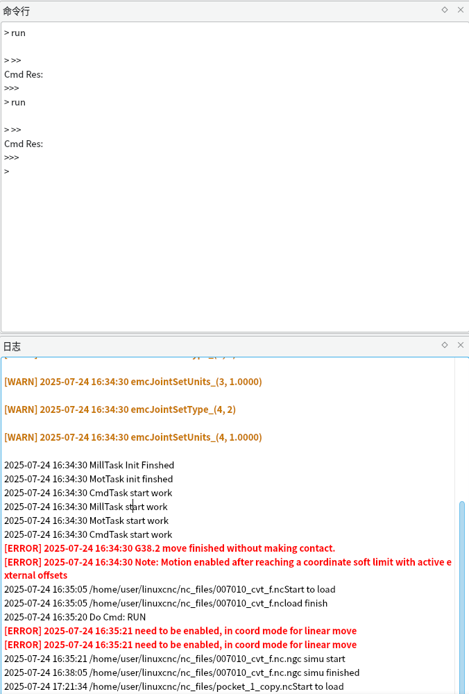

# CNCSimulation Software
A CNCSimulation software include these feature.
1. DeCode NC, show the NC Path and get the NC featured information.
2. Get the interpaltion result include kinematics and fined traject.
3. Combaninded with Servo limination.
4. Optimaze NC path and pose base on Servo limination.
5. Optimaze traject paras base on Servo limination.

Prerequirements:
1.Boostlib
2.Qt >= 5.18 or Qt6

Function
1.NC PATH

2.NC MDI edit

3.NCParser and EMCMot infomation.

4.Motion Profile Ploter

5.EMC Cmdline and Log
